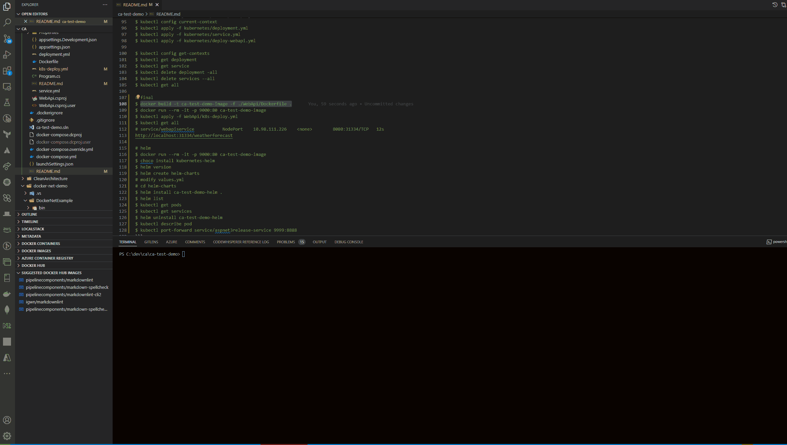
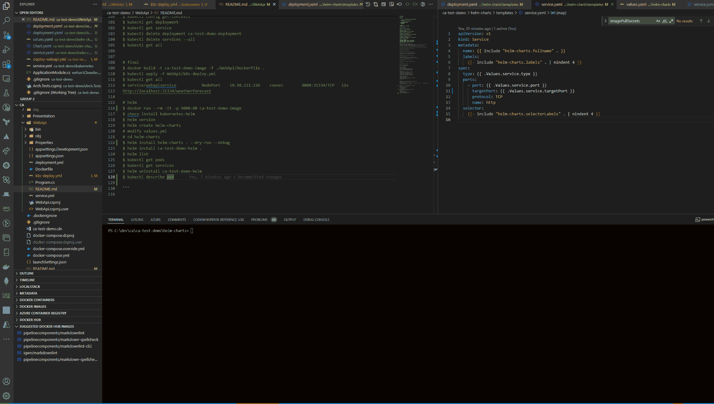

CA Test Demo

Tech Stack

- [x] CA
      

- [x] NetArchTest
      

- [x] docker/docker-compose
- [x] Kubernetes
  - 
- [x] Helm Charts
      

```javascript
$ dotnet new sln -o ca-test-demo

# cd ca-test-demo

$ dotnet new classlib -o Domain

$ dotnet new classlib -o Application

# Application => Domain
$ dotnet add .\Application\ reference .\Domain\

$ dotnet new classlib -o Infrastructure

# Infrastructure => Application
$ dotnet add .\Infrastructure\ reference .\Application\

# dotnet new classlib -o Presentation

# Presentation => Application
$ dotnet add .\Presentation\ reference .\Application\

$ dotnet new webapi -o WebApi

# WebApi => Application
$ dotnet add .\WebApi\ reference .\Presentation\
$ dotnet add .\WebApi\ reference .\Infrastructure\
$ dotnet add .\WebApi\ reference .\Application\

$ dotnet sln add (ls -r **/*.csproj)

$ dotnet add .\Application\ package MediatR
$ dotnet add .\Application\ package Microsoft.Extensions.DependencyInjection.Abstractions
$ dotnet add .\Application\ package FluentValidation
$ dotnet add .\Application\ package FluentValidation.DependencyInjectionExtensions

$ dotnet add .\Infrastructure\ package Microsoft.Extensions.DependencyInjection.Abstractions

$ dotnet add .\WebApi\ package Serilog.AspNetCore

$ dotnet build ca-test-demo.sln

$ dotnet new xunit -o Arch.Tests

$ dotnet sln add ./Arch.Tests/Arch.Tests.csproj

$ dotnet add .\Arch.Tests\ package NetArchTest.Rules
$ dotnet add .\Arch.Tests\ package FluentAssertions

# run arch test
$  dotnet test .\Arch.Tests\Arch.Tests.csproj

# create docker image
$ docker build -t ca-test-demo -f ./WebApi/Dockerfile .
$ docker run --name ca-test-demo -p 8082:80 -d ca-test-demo

# http://localhost:8082/weatherforecast

# docker
$ docker images

$ docker create --name webapi-counter ca-test-demo

$ docker ps -a

$ docker start webapi-counter

$ docker stop webapi-counter
$ docker rm webapi-counter

$ docker compose build
$ docker compose up
$ docker compose down
# https://localhost:59105/swagger/index.html
# https://localhost:59105/weatherforecast
# http://localhost:59106/swagger/index.html

# Kubernetes
$ dotnet build ca-test-demo.sln -c release
$ dotnet run --project .\WebApi\WebApi.csproj
$ kubectl config current-context
$ kubectl apply -f kubernetes/deployment.yml
$ kubectl apply -f kubernetes/service.yml
$ kubectl apply -f kubernetes/deploy-webapi.yml

$ kubectl config get-contexts
$ kubectl get deployment
$ kubectl get service
$ kubectl delete deployment -all
$ kubectl delete services --all
$ kubectl get all

# final
$ docker build -t ca-test-demo-image -f ./WebApi/Dockerfile .
$ docker run --rm -it -p 9000:80 ca-test-demo-image
$ kubectl apply -f WebApi/k8s-deploy.yml
$ kubectl get all
# service/webapiservice           NodePort    10.98.111.226    <none>        8080:31334/TCP   12s
http://localhost:31334/weatherforecast

# helm charts
$ docker run --rm -it -p 9000:80 ca-test-demo-image
$ choco install kubernetes-helm
$ helm version
$ helm create helm-charts
# modify values.yml
# cd helm-charts
$ helm install ca-test-demo-helm .
$ helm list
$ kubectl get pods
$ kubectl get services
$ helm uninstall ca-test-demo-helm
$ kubectl describe pod
$ kubectl port-forward service/aspnet3release-service 9999:8888
```
